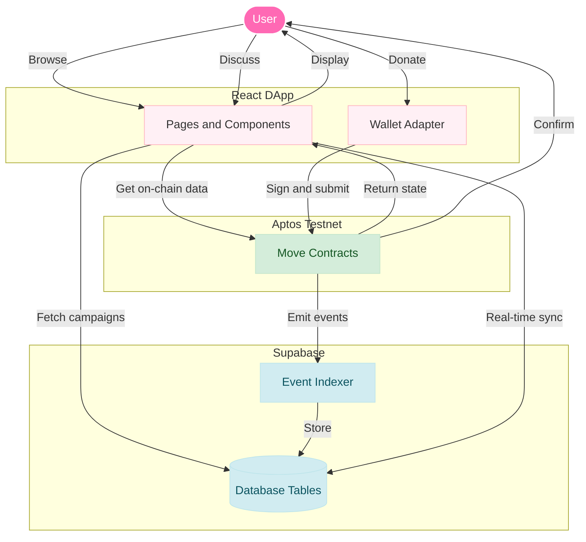
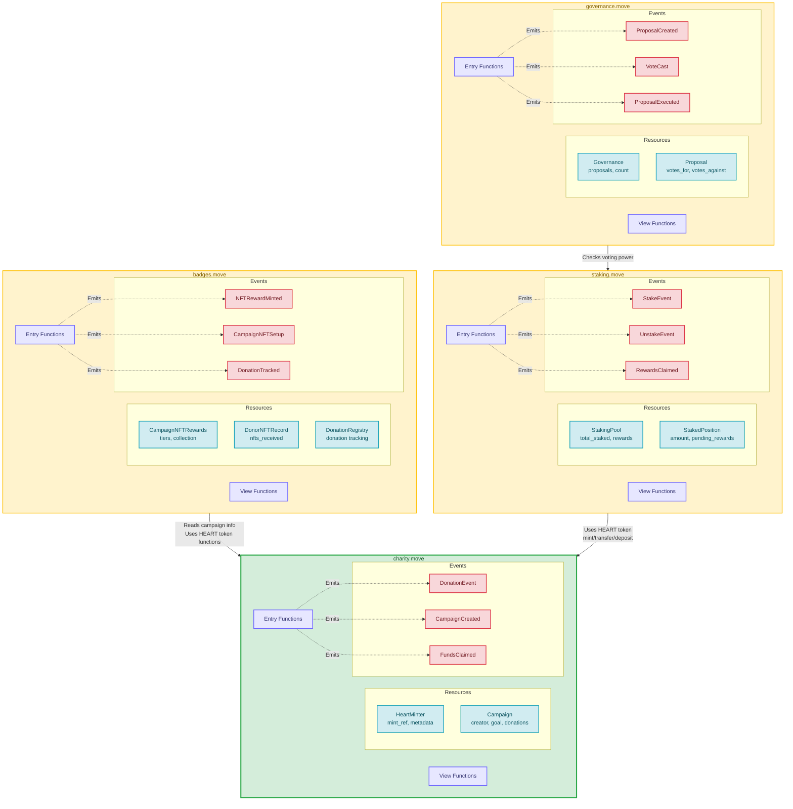

<div align="center">


  <h1 align="center"><b>Charity Rewards </b></h1>
  <p align="center">The Digital Garden of Giving 🌱 Try Now - <a href="https://www.charityrewards.club/">charityrewards.club</a> </p>
  <p align="center">

  </p>
  <p align="center">
    <a href="#-key-features">Key Features</a> •
    <a href="#-technology-stack">Tech Stack</a> •
    <a href="#-getting-started">Getting Started</a> •
    <a href="#-project-structure">Project Structure</a> •
    <a href="#-contributing">Contributing</a>
  </p>
</div>

---

##   Mission & Vision

**CharityRewards** is a next-generation decentralized application built on the Aptos blockchain, designed to revolutionize philanthropy. Our mission is to foster a global community of givers by making charitable donations transparent, engaging, and rewarding. We transform every act of compassion into a tangible, beautiful experience—nurturing a personal "Digital Garden of Giving" that visually represents your impact, while rewarding your generosity with on-chain assets.

## ✨ Key Features

-   **🌍 Discover & Donate:** Browse a curated marketplace of verified charitable campaigns and donate directly from your wallet using APT.
-   ❤️ **Earn Rewards:** Receive `HEART` tokens, the protocol's utility and governance token, for every donation you make.
-   🌱 **Gamified Impact:** Watch your personal Digital Garden flourish with every contribution, providing a beautiful, visual representation of your collective impact.
-   🏆 **NFT Achievement Badges:** Unlock and collect unique, non-transferable NFT badges for reaching donation milestones and supporting specific cause categories.
-   🔐 **Staking & Governance:** Stake your `HEART` tokens to earn yield and gain voting power to influence the future direction of the platform.
-   💎 **Immersive User Experience:** A stunning, animated UI built with GSAP, Framer Motion, and Three.js for a truly engaging and memorable experience.
-   🔍 **Full Transparency:** Every donation is a verifiable transaction on the Aptos blockchain, accessible to anyone via the explorer.

## 💻 Technology Stack

This application is built with a modern, high-performance web stack:

-   **Framework:** [Vite](https://vitejs.dev/) + [React](https://reactjs.org/)
-   **Language:** [TypeScript](https://www.typescriptlang.org/)
-   **Styling:** [Tailwind CSS](https://tailwindcss.com/) with a custom design system.
-   **UI Components:** [shadcn/ui](https://ui.shadcn.com/)
-   **Animation:** [GSAP (GreenSock)](https://greensock.com/gsap/) & [Framer Motion](https://www.framer.com/motion/)
-   **3D/WebGL:** [Three.js](https://threejs.org/) via [React Three Fiber](https://docs.pmnd.rs/react-three-fiber/getting-started/introduction)
-   **Blockchain Integration:** [Aptos TS SDK](https://aptos.dev/sdks/ts-sdk-v2) & [Aptos Wallet Adapter](https://github.com/aptos-labs/aptos-wallet-adapter)
-   **State Management:** React Context & [TanStack Query](https://tanstack.com/query/latest)
-   **Aptos Indexer:**  [Geomi (Formerly Aptos Build)](https://geomi.dev/)
-   **Backend Storage and Edge Functions:**  [Supabase](https://www.supabase.com/)

## 💻 Infrastructure Diagram 





## 💻 Contract Details 

Check charity-rewards-contracts folder for all move modules and deployed addresses on explorer



## 🚀 Getting Started

Follow these instructions to set up and run the project locally. (You can also test the site online @ www.charityrewards.club

### Prerequisites

-   [Node.js](https://nodejs.org/en/) (v18 or higher)
-   [npm](https://www.npmjs.com/) or [Bun](https://bun.sh/)
-   [Petra Wallet](https://petra.app/) browser extension (or another compatible Aptos wallet)
-   Testnet APT tokens from an [Aptos Faucet](https://aptoslabs.com/testnet-faucet).

### Installation

1.  **Clone the repository:**
2.  **Install dependencies:**
    ```sh
    npm install
    ```

### Supabase & Environment Setup (Critical)

This project requires a Supabase backend for caching and real-time features. To run the app, you must set up your local environment variables.

1.  **Create `.env.example`:**
    ```sh
    # Copy template for local use
    cp .env.example .env
    ```
2.  **Edit the new `.env` file** and paste your actual Supabase URL and Public Key. These are needed for the client-side DApp to connect to the backend.

    ```
    # Content of .env file
    VITE_SUPABASE_URL="https://odjusbwohcdxptgcekzu.supabase.co"
    VITE_SUPABASE_KEY="YOUR_ACTUAL_PUBLISHABLE_KEY" 
    ```

### Running the Development Server

Start the Vite development server. It will be accessible at `http://localhost:8080`.

```sh
npm run dev
```

## 📂 Project Structure

The frontend application is organized with a focus on scalability and maintainability.

```
/src
├── App.tsx             # Main application component with routing
├── main.tsx            # Application entry point
├── services/           # Blockchain interaction logic (e.g., aptos.ts)
├── components/
│   ├── ui/             # Reusable, unstyled UI components (from shadcn/ui)
│   └── (feature)/      # Complex components like DonationModal.tsx
├── pages/              # Each route's main component (e.g., Marketplace.tsx)
├── contexts/           # Global state providers (ThemeContext, WalletContext)
├── hooks/              # Custom React hooks (e.g., use-mobile.tsx)
├── lib/                # Utility functions and constants (utils.ts, campaigns.tsx)
├── types.ts            # Global TypeScript type definitions
└── index.css           # Global styles & Tailwind CSS layers
```

## 🤝 Contributing

Contributions are welcome and essential for the growth of CharityRewards. Whether you're fixing a bug, proposing a new feature, or improving documentation, your help is valued.

Please follow these steps to contribute:
1.  **Fork the repository.**
2.  Create a new branch: `git checkout -b feature/your-feature-name`
3.  Make your changes and commit them with a descriptive message.
4.  Push to your fork: `git push origin feature/your-feature-name`
5.  Open a **Pull Request** and describe your changes in detail.

Please read our `CONTRIBUTING.md` for more details on our code of conduct and the process for submitting pull requests.

Demo video link - https://drive.google.com/file/d/1xRf65PrSTGOnYUwyjgBSgAqaAjkYvowe/view?usp=sharing

## ⚖️ License

This project is licensed under the MIT License. See the [LICENSE](LICENSE) file for details.

